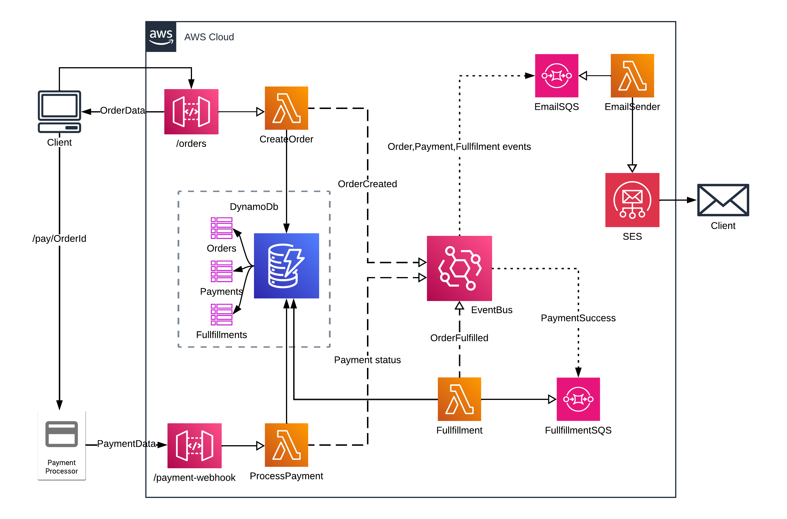
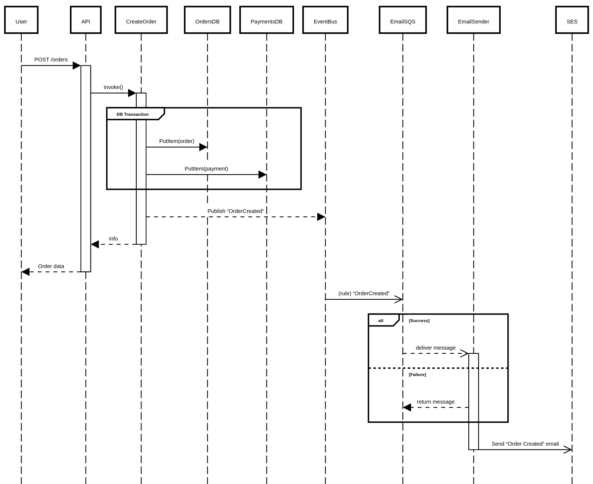

# AWS Marketplace POC

This repository contains the source code and infrastructure configuration for the test project for POC for digital marketplace order processing system. It includes multiple AWS Lambda functions and a CDK (Cloud Development Kit) stack for deploying infrastructure to AWS.

---

## Architecture

Cloud Architecture Diagram


Order Sequece Diagram


---

## 📁 Project Structure

```
.
├── lambdas/                  # Lambda function projects
│   └── <LambdaName>/        # Individual Lambda function folders
│       ├── <LambdaName>.csproj
│       └── publish/         # Output directory after build
├── src/
│   └── Altusproj/           # CDK infrastructure project
│       └── Altusproj.csproj
│   └── Altusproj.sln        # Solution file
└── build_deploy.sh          # Build and deployment script
```

---

## 🛠️ Prerequisites

Make sure you have the following installed:

- [.NET 8 SDK or newer](https://dotnet.microsoft.com/en-us/download)
- [AWS CDK](https://docs.aws.amazon.com/cdk/latest/guide/getting_started.html)
- AWS CLI with a configured profile (e.g., `altus`)
- Linux/macOS environment (or WSL on Windows)

---

## 🚀 Build & Deploy Instructions

To build all Lambda functions and deploy the CDK stack:

```bash
./build_deploy.sh
```

Optional parameters after the script (e.g., specific stacks or context values) are forwarded to `cdk deploy`. Example:

```bash
./build_deploy.sh --context env=prod
```

---

## 📦 What the Script Does

1. Iterates through each subdirectory in `lambdas/` and runs `dotnet publish` to build the Lambda project in Release mode.
2. Builds the CDK project using `dotnet build`.
3. Deploys the CDK stack with `cdk deploy --require-approval never` using the AWS profile `altus`.

---

## 🧼 Clean-Up

To destroy the deployed stack (use with caution):

```bash
cdk destroy --profile altus
```
